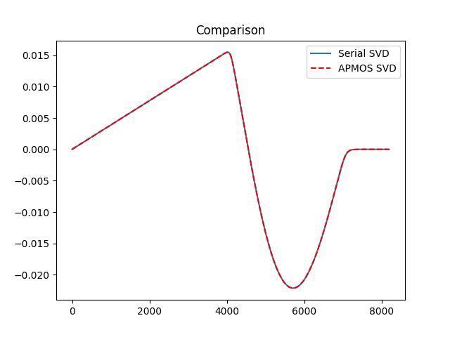

# Parallelized proper orthogonal decomposition

To reproduce experiment:
1. Run `python data_splitter.py` to generate serial POD modes (using method of snapshots and SVD) as well as split data files for loading up via MPI4PY.
2. In a new terminal run `export OPENBLAS_NUM_THREADS=1` to ensure numpy on each rank uses single threading.
3. In the same terminal, run `mpirun -np 6 python APMOS.py`. There is a flag `mos_mode` in line 9, toggle this between `True` or `False` to use different methods to compute the right singular vector during local calculation.
4. Run `python basis_plotting.py` to check the comparison of the APMOS modes (two different methods) and the Serial computations.

## Comparisons of serial and parallel POD deployments.

### Serial method of snapshots

### APMOS
