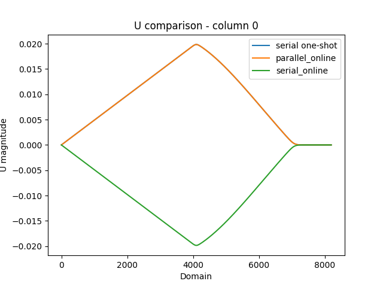
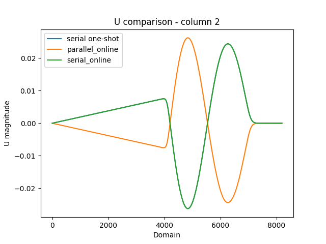
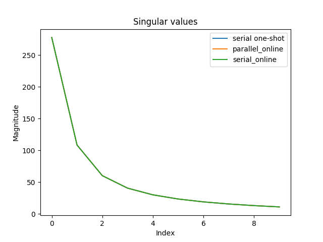

# PyParSVD

This implementation allows for a singular value decomposition which is:
1. Distributed using MPI4Py
2. Streaming - data can be shown in batches to update the left singular vectors
3. Randomized for further acceleration of any serial components of the overall algorithm.

The streaming algorithm used in this implementation is available in:
"Sequential Karhunen–Loeve Basis Extraction and its Application to Images" by Avraham Levy and Michael Lindenbaum. IEEE TRANSACTIONS ON IMAGE PROCESSING, VOL. 9, NO. 8, AUGUST 2000. This algorithm is implemented in `Online_SVD_Serial.py`.

The distributed computation of the SVD follows the implementation in 
"Approximate partitioned method of snapshots for POD." by Wang, Zhu, Brian McBee, and Traian Iliescu. Journal of Computational and Applied Mathematics 307 (2016): 374-384. This algorithm is validated in `APMOS_Validation/`.

The parallel QR algorithm (the TSQR method) required for the streaming feature may be found in
"Direct QR factorizations for tall-and-skinny matrices in MapReduce architectures." by Benson, Austin R., David F. Gleich, and James Demmel. 2013 IEEE international conference on big data. IEEE, 2013. This algorithm is validated in `Parallel_QR`.

The randomized algorithm used to accelerate the computation of the serial SVD in partitioned method of snapshots may be found in 
"Finding structure with randomness: Probabilistic algorithms for constructing approximate matrix decompositions." by Halko, Nathan, Per-Gunnar Martinsson, and Joel A. Tropp. SIAM review 53.2 (2011): 217-288. 

To enable this feature set `low_rank=True` for initializing the `online_svd_calculator` class object in `online_svd_parallel.py`

To reproduce results on a shared memory platform (needs atleast 6 available ranks):
`export OPENBLAS_NUM_THREADS=1` to ensure numpy does not multithread for this experiment.

1. Run `python data_splitter.py` to generate exemplar data etc.
2. Run `python online_svd_serial.py` for serial deployment of streaming algorithm.
3. Run `mpirun -np 6 python online_svd_parallel.py` for parallel/streaming deployment.

Caution: Due to differences in the parallel and serial versions of the algorithm, singular vectors may be "flipped". An orthogonality check is also deployed for an additional sanity check.

Example extractions of left singular vectors and singular values

Even the simple problem demonstrated here (8192 spatial points and 800 snapshots) achieves a dramatic acceleration in time to solution from serial to parallelized-streaming implementations (~25X). Note that the key advantage of the parallelized version is the lack of a data-transfer requirement in case this routine is being called from a simulation. 