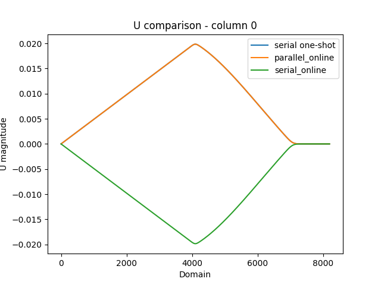
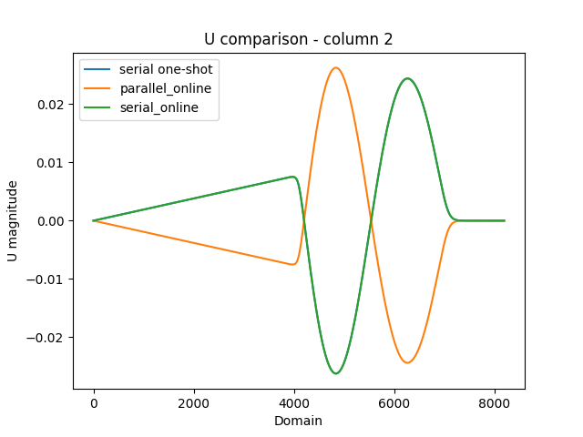
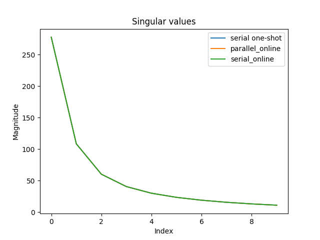

# PYPARSVD
  
<p align="center">
  <a href="http://mengaldo.github.io/PyParSVD/" target="_blank" >
    
  </a>
</p>

<p align="center">
  <!--    <a href="https://doi.org/" target="_blank">
    
  </a> -->
  
  <a href="https://zenodo.org/badge/latestdoi/342338443" target="_blank">
    
  </a>
  <a href="https://github.com/mengaldo/PyParSVD/LICENSE" target="_blank">
    
  </a>
  <!--   <a href="https://badge.fury.io/py/pyspod">
    
  </a> -->
  <a href="https://travis-ci.com/mengaldo/PyParSVD" target="_blank">
    	  
  </a>
  <!--    <a href="https://coveralls.io/github/mathLab/PySPOD" target="_blank">
    
  </a> -->
  <a href="https://app.codacy.com/project/badge/Grade/a97f1b7817bf4429b25a0c8acafcb88e)](https://www.codacy.com/gh/mengaldo/PyParSVD/dashboard?">
    
  </a>
</p>


This library allows for a singular value decomposition (SVD) that is:
1. *Distributed* using `MPI4Py`
2. *Streaming* - data can be shown in batches to update the left singular vectors
3. *Randomized* - further acceleration of any serial components of the overall algorithm.

The streaming algorithm used in this library is from [(Levy and Lindenbaum 1998)](#Levy and Lindenbaum 1998), and its implementation can be found in [**pyparsvd/parsvd_parallel.py**](pyparsvd/parsvd_parallel.py).

The distributed computation of the SVD follows [(Wang et al 2016)](#Wang et al 2016). This algorithm is validated in `APMOS_Validation/`.

The parallel QR algorithm (the TSQR method) required for the streaming feature follows [(Benson et al 2013)](#Benson et al 2013). 
This algorithm is validated in `Parallel_QR`.

The randomized algorithm used to accelerate the computation of the serial SVD in partitioned method of snapshots follows [(Halko et al 20131](#Halko et al 2011)

To enable this feature set `low_rank=True` for initializing the `online_svd_calculator` class object in `online_svd_parallel.py`

To reproduce results on a shared memory platform (needs atleast 6 available ranks):
`export OPENBLAS_NUM_THREADS=1` to ensure numpy does not multithread for this experiment.

1. Run `python data_splitter.py` to generate exemplar data etc.
2. Run `python online_svd_serial.py` for serial deployment of streaming algorithm.
3. Run `mpirun -np 6 python online_svd_parallel.py` for parallel/streaming deployment.

Caution: Due to differences in the parallel and serial versions of the algorithm, singular vectors may be "flipped". An orthogonality check is also deployed for an additional sanity check.

Example extractions of left singular vectors and singular values




Even the simple problem demonstrated here (8192 spatial points and 800 snapshots) achieves a dramatic acceleration in time to solution from serial to parallelized-streaming implementations (~25X). Note that the key advantage of the parallelized version is the lack of a data-transfer requirement in case this routine is being called from a simulation.


## Testing
Regression tests are deployed using Travis CI, that is a continuous intergration framework. 
You can check out the current status of **PySPOD** [here](https://travis-ci.org/mengaldo/PySPOD).

IF you want to run tests locally, you can do so by:

```bash
> cd tests/
> pytest -v
```

## References

#### (Levy and Lindenbaum 1998) 
*Sequential Karhunen–Loeve Basis Extraction and its Application to Images.* [[DOI](https://ieeexplore.ieee.org/abstract/document/723422)]

#### (Wang et al 2016) 
*Approximate partitioned method of snapshots for POD.* [[DOI](https://www.sciencedirect.com/science/article/pii/S0377042715005774)]

#### (Benson et al 2013)
*Direct QR factorizations for tall-and-skinny matrices in MapReduce architectures.* [[DOI](https://ieeexplore.ieee.org/document/6691583)]

#### (Halko et al 2011) 
*Finding structure with randomness: Probabilistic algorithms for constructing approximate matrix decompositions.* [[DOI](https://epubs.siam.org/doi/abs/10.1137/090771806)]
