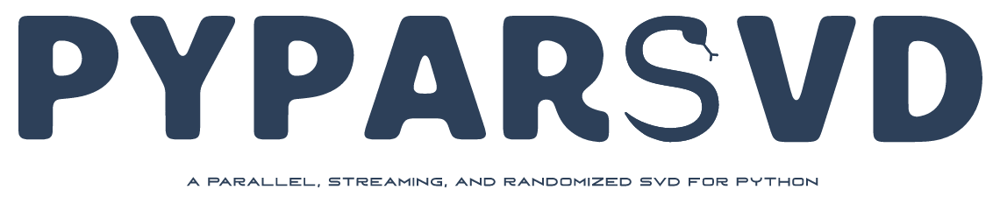
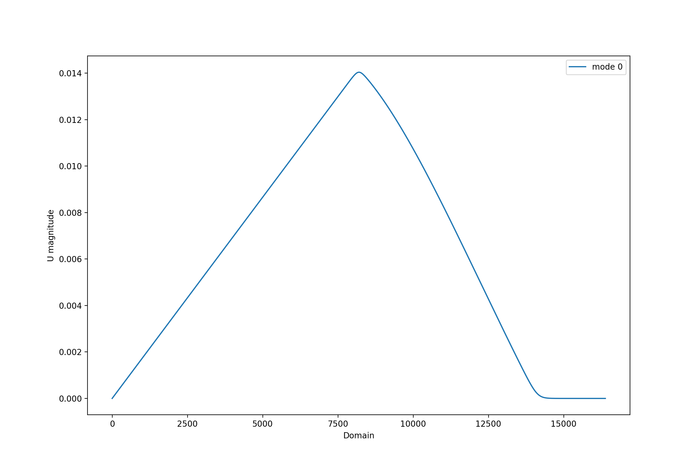
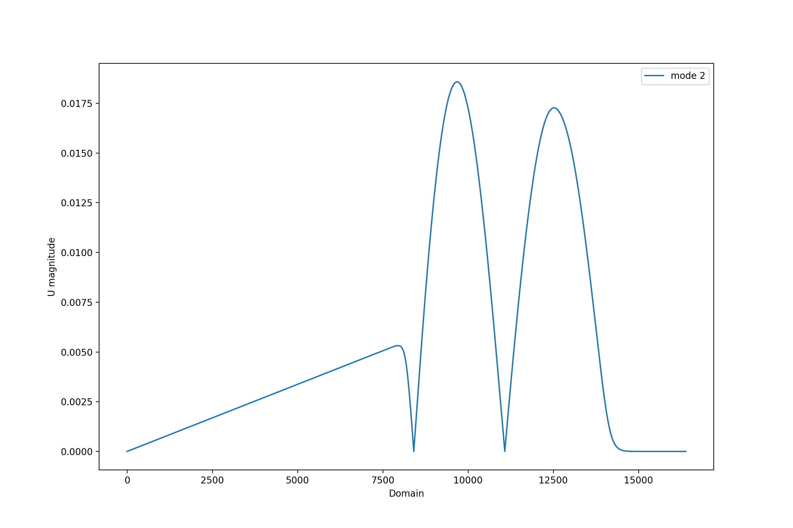
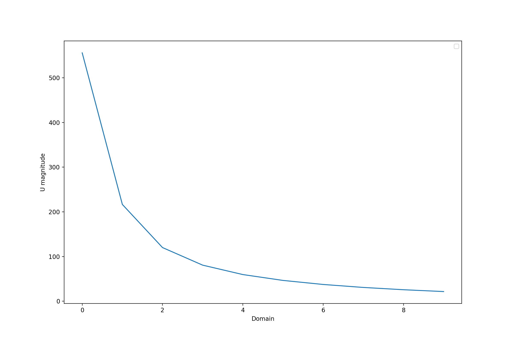

<p align="center">
  <a href="http://mengaldo.github.io/PyParSVD/" target="_blank" >
    
  </a>
</p>

<p align="center">
<!--    <a href="https://doi.org/" target="_blank">
  
</a> -->
  
<a href="https://zenodo.org/badge/latestdoi/342338443" target="_blank">
  
</a>
<a href="https://github.com/mengaldo/PyParSVD/LICENSE" target="_blank">
  
</a>
<!--   <a href="https://badge.fury.io/py/pyspod">
  
</a> -->
<a href="https://travis-ci.com/Romit-Maulik/PyParSVD" target="_blank">
  	  
</a>
<!--    <a href="https://coveralls.io/github/mathLab/PySPOD" target="_blank">
  
</a> -->
<a href="https://app.codacy.com/project/badge/Grade/a97f1b7817bf4429b25a0c8acafcb88e)](https://www.codacy.com/gh/mengaldo/PyParSVD/dashboard?">
  
</a>
</p>

# PyParSVD: Python Parallel Singular Value Decomposition

## Table of contents

  * [Description](#description)
  * [Testing](#testing)
  * [References](#references)
  * [License](#license)


## Description
The **PyParSVD** library implements both a serial and a parallel singular value decomposition (SVD). The implementation of the library is conveniently:

1. **Distributed** using `MPI4Py` (for parallel SVD);
2. **Streaming** - data can be shown in batches to update the left singular vectors;
3. **Randomized** - further acceleration of any serial components of the overall algorithm.

The **distributed** computation of the SVD follows [(Wang et al 2016)](#Wang-et-al-2016). The **streaming** algorithm used in this library is from [(Levy and Lindenbaum 1998)](#Levy-and-Lindenbaum 1998),  where the parallel QR algorithm (the TSQR method) required for the streaming feature follows [(Benson et al 2013)](#Benson-et-al-2013). Finally, the **randomized** algorithm follows [(Halko et al 2013)](#Halko-et-al-2011).

The library is organized using a base class, [**pyparsvd/parsvd_base.py**](pyparsvd/parsvd_base.py), that implements methods shared across the two derived classes, [**pyparsvd/parsvd_serial.py**](pyparsvd/parsvd_serial.py), and [**pyparsvd/parsvd_parallel.py**](pyparsvd/parsvd_parallel.py). The former implements the *serial SVD*, while the latter implements the *parallel SVD*. We also provide a module that implements some postprocessing utilities, [**pyparsvd/postprocessing.py**](pyparsvd/postprocessing.py), that can be used as a standalone package or directly called from the derived classes [**pyparsvd/parsvd_serial.py**](pyparsvd/parsvd_serial.py), and [**pyparsvd/parsvd_parallel.py**](pyparsvd/parsvd_parallel.py).

A simple case can be implementated following [**tutorials/basic.py**](tutorial/basic.py), where we generate data for the the 1D Burgers' equation with a pre-written routine pre-stored data from [**tutorials/basic/data/data_splitter.py**](tutorials/basic/data/data_splitter.py). The data generated by the `data_splitter.py` routine has been already splitted into different distributed ranks. In order to run this simple case, you need to run the data generation routine in [**tutorials/basic/data/**](tutorials/basic/data/), as follows:
```bash
python3 data_splitter.py
```

You can then go to [**tutorials/basic/**](tutorials/basic/), and run
```bash
mpirun -np 6 python3 basic.py
```

This should produce a set of figures, under a folder called *results* similar to the ones below

**Serial** 
<p align="center"> 
   
   
   
</p>

**Parallel**
<p align="center"> 
   
   
   
</p>

***Caution***: Due to differences in the parallel and serial versions of the algorithm, singular vectors may be "flipped". 
An orthogonality check is also deployed for an additional sanity check.

The main components of the implementation in [**tutorials/basic.py**](tutorial/basic.py) are as follows

- import of the libraries 
```python
import os
import sys
import numpy as np

# Import library specific modules
sys.path.append(os.path.join("../../"))
from pyparsvd.parsvd_serial   import ParSVD_Serial
from pyparsvd.parsvd_parallel import ParSVD_Parallel
```

- instantiation of the serial and parallel SVD objects
```python
# Construct SVD objects
SerSVD = ParSVD_Serial(K=10, ff=1.0)
ParSVD = ParSVD_Parallel(K=10, ff=1.0, low_rank=True)
```
We note that the parameter `K` corresponds to the number of modes to truncate, the parameter `ff` is the forget factor, while the parameter `low_rank=True` allows for randomized SVD.

- reading of the data for both the serial and parallel SVD computations
```python
# Path to data
path = os.path.join(CFD, '../../tests/data/')

# Serial data
initial_data_ser = np.load(os.path.join(path, 'Batch_0_data.npy'))
new_data_ser = np.load(os.path.join(path, 'Batch_1_data.npy'))
newer_data_ser = np.load(os.path.join(path, 'Batch_2_data.npy'))
newest_data_ser = np.load(os.path.join(path, 'Batch_3_data.npy'))

# Parallel data
initial_data_par = np.load(os.path.join(path, 'points_rank_' + str(ParSVD.rank) + '_batch_0.npy'))
new_data_par = np.load(os.path.join(path, 'points_rank_' + str(ParSVD.rank) + '_batch_1.npy'))
newer_data_par = np.load(os.path.join(path, 'points_rank_' + str(ParSVD.rank) + '_batch_2.npy'))
newest_data_par = np.load(os.path.join(path, 'points_rank_' + str(ParSVD.rank) + '_batch_3.npy'))
```

- serial SVD computation
```python
# Do first modal decomposition -- Serial
SerSVD.initialize(initial_data_ser)

# Incorporate new data -- Serial
SerSVD.incorporate_data(new_data_ser)
SerSVD.incorporate_data(newer_data_ser)
SerSVD.incorporate_data(newest_data_ser)
```

- parallel SVD computation
```python
# Do first modal decomposition -- Parallel
ParSVD.initialize(initial_data_par)

# Incorporate new data -- Parallel
ParSVD.incorporate_data(new_data_par)
ParSVD.incorporate_data(newer_data_par)
ParSVD.incorporate_data(newest_data_par)
```

- basic postprocessing where we plot the results
```python
# Basic postprocessing
if ParSVD.rank == 0:

	# Save results
	SerSVD.save()
	ParSVD.save()

	# Visualize modes
	SerSVD.plot_1D_modes(filename='serial_1d_modes.png')
	ParSVD.plot_1D_modes(filename='parallel_1d_modes.png')
```


## Testing
Regression tests are deployed using Travis CI, that is a continuous intergration framework. 
You can check out the current status of **PyParSVD** [here](https://travis-ci.org/Romit-Maulik/PyParSVD).

IF you want to run tests locally, you can do so by:

```bash
> cd tests/
> mpirun -np 6 python3 -m pytest --with-mpi -v
```


## References

#### (Levy and Lindenbaum 1998) 
*Sequential Karhunen–Loeve Basis Extraction and its Application to Images.* [[DOI](https://ieeexplore.ieee.org/abstract/document/723422)]

#### (Wang et al 2016) 
*Approximate partitioned method of snapshots for POD.* [[DOI](https://www.sciencedirect.com/science/article/pii/S0377042715005774)]

#### (Benson et al 2013)
*Direct QR factorizations for tall-and-skinny matrices in MapReduce architectures.* [[DOI](https://ieeexplore.ieee.org/document/6691583)]

#### (Halko et al 2011) 
*Finding structure with randomness: Probabilistic algorithms for constructing approximate matrix decompositions.* [[DOI](https://epubs.siam.org/doi/abs/10.1137/090771806)]


  
## How to contribute

Contributions improving code and documentation, as well as suggestions about new features are more than welcome!

The guidelines to contribute are as follows: 
1. open a new issue describing the bug you intend to fix or the feature you want to add.
2. fork the project and open your own branch related to the issue you just opened, and call the branch `fix/name-of-the-issue` if it is a bug fix, or `feature/name-of-the-issue` if you are adding a feature.
3. ensure to use 4 spaces for formatting the code.
4. if you add a feature, it should be accompanied by relevant tests to ensure it functions correctly, while the code continue to be developed.
5. commit your changes with a self-explanatory commit message. 
6. push your commits and submit a pull request. Please, remember to rebase properly in order to maintain a clean, linear git history.


## License

See the [LICENSE](LICENSE.rst) file for license rights and limitations (MIT).
